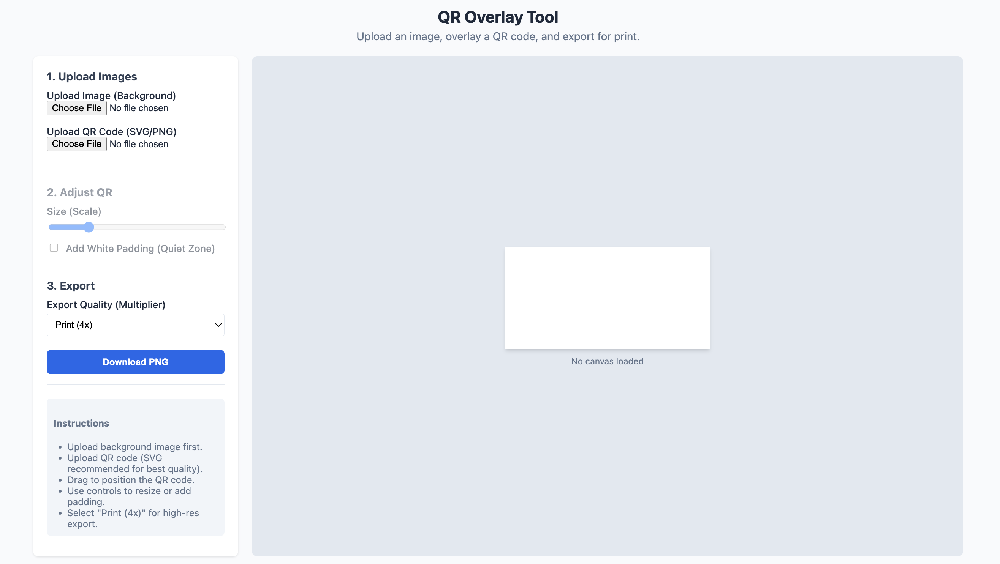

# QR Overlay Tool

A simple, client-side web tool to overlay a QR code onto a flyer or background image. Built with [Fabric.js](http://fabricjs.com/).

> Will be extended to be a more general image overlay tool.

## Features

- **No Server Uploads**: Runs entirely in your browser. Your images stay private.
- **SVG Support**: Automatically rasterizes SVG QR codes for high-quality placement.
- **Print Ready**: Add a white "quiet zone" padding behind your QR code and export at high DPI.
- **Easy Adjustments**: Drag, drop, and resize your QR code visually.

## How to Use

1. **Open `index.html`** in your browser.
2. **Upload Background**: Select your flyer image (JPG/PNG).
3. **Upload QR Code**: Select your QR code image. SVG is recommended for best print quality.
4. **Position & Resize**: Drag the QR code to the desired location. Use the "Size" slider to adjust.
5. **Add Padding**: Check "Add White Padding" to ensure the QR code is scannable on dark or busy backgrounds.
6. **Export**: Choose a quality multiplier (e.g., Print 4x) and click "Download PNG".

## Print Size Presets & Guidance

When printing, you want your QR code to be physical large enough to scan. A common rule of thumb is **minimum 2cm (0.8 inches)** wide.

If you are exporting at **300 DPI**, here are the pixel dimensions for common physical sizes:

| Physical Size | @ 300 DPI | Recommended Use |
|Data | Pixel Size | Note |
|---|---|---|
| **0.8 inch (2 cm)** | ~240 px | **Minimum** for reliable scanning |
| **1.0 inch (2.5 cm)** | ~300 px | Standard flyers |
| **1.5 inch (3.8 cm)** | ~450 px | Large posters |
| **2.0 inch (5 cm)** | ~600 px | Distant scanning |

**Tip**: Always test scan your printed flyer before mass production!

## Technical Details

- **Fabric.js**: Handles the canvas interactivity.
- **SVG Handling**: SVGs are converted to blobs and loaded as standard images to avoid cross-origin taint and ensure consistent rendering.
- **Export Multiplier**: The tool uses Fabric's `multiplier` feature to scale up the canvas output, ensuring high resolution without needing a massive screen.

## Development

No build step required. Just serve the files:

```bash
# Example with Python
python3 -m http.server
```
